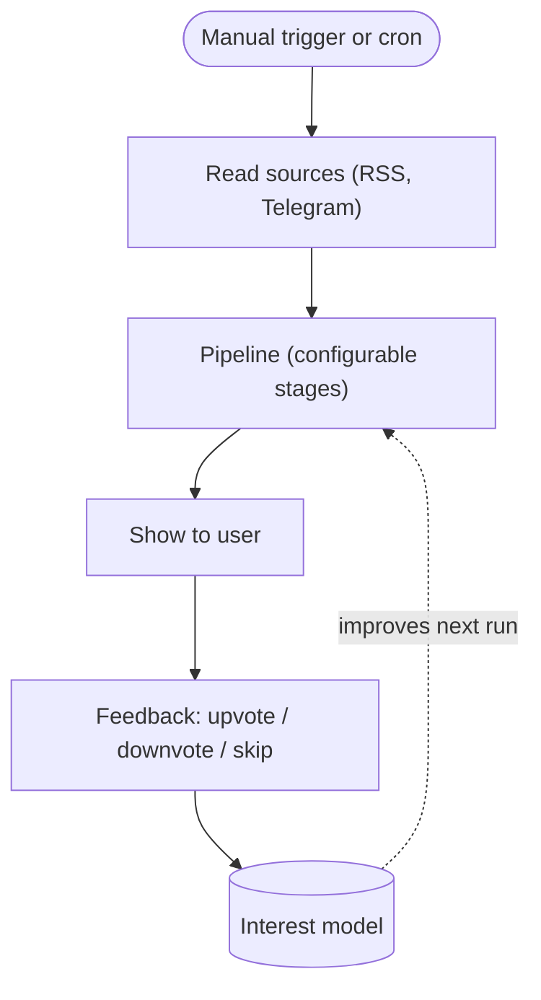
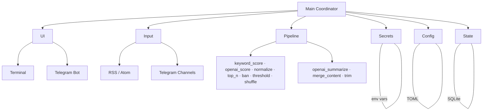
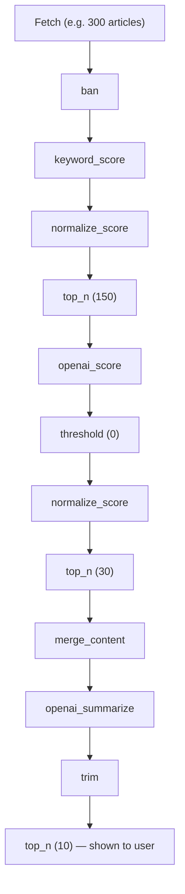
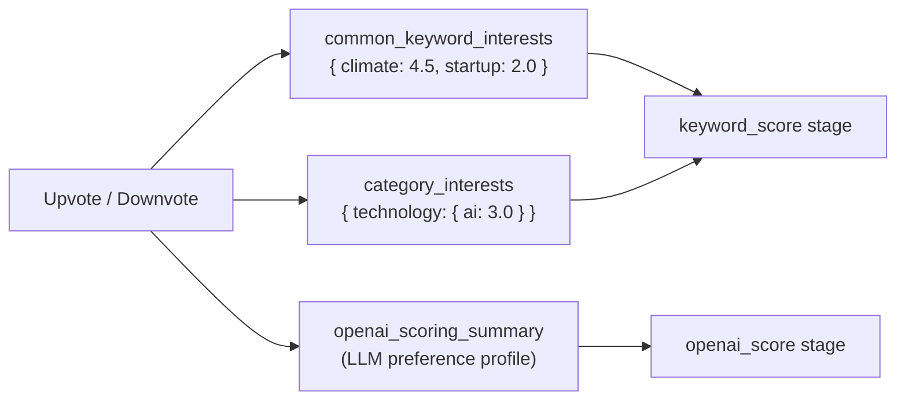

# SmartReader

Personalized content aggregator. Reads RSS feeds and Telegram channels, scores articles against your evolving interests, summarizes the best ones with an LLM, and gets smarter with every piece of feedback you give it.

---

## Table of Contents

- [How It Works](#how-it-works)
- [Architecture](#architecture)
- [Quick Start](#quick-start)
- [Configuration](#configuration)
- [Pipeline Stages](#pipeline-stages)
- [User Interfaces](#user-interfaces)
- [Input Sources](#input-sources)
- [Scoring and Interests](#scoring-and-interests)
- [Environment Variables](#environment-variables)
- [Running](#running)
- [Testing](#testing)
- [Documentation](#documentation)

---

## How It Works



Content is scored **twice**: a fast keyword pass (L1) trims the bulk before any LLM calls, then a refined LLM pass (L2) on summarized text drives the final ranking. Upvotes and downvotes continuously update the interest model that feeds into L1 scoring.

---

## Architecture



All major components are abstract interfaces with swappable implementations. New sources or storage backends follow the same pattern.

Initialization order: `secrets → config → state → pipeline → ui → input`

---

## Quick Start

**Prerequisites:** Python 3.12+, pip

```bash
# 1. Clone and set up the virtualenv
git clone <repo-url> smartreader
cd smartreader
python -m venv .venv
source .venv/bin/activate
pip install -r requirements.txt

# 2. Configure
cp config.schema.toml config.toml   # then edit config.toml
cp .env.example .env                # then fill in secrets

# 3. Run
./run.sh
```

> `run.sh` sources `.env` and activates the venv automatically — no need to activate it manually after the first setup.

For a fully annotated configuration example see [`docs/config.example.toml`](docs/config.example.toml).

---

## Configuration

Configuration lives in `config.toml` (TOML format).
Reference schema with all options and defaults: [`config.schema.toml`](config.schema.toml).
Full annotated example: [`docs/config.example.toml`](docs/config.example.toml).

### Top-level sections

| Section | Purpose |
|---------|---------|
| `[common]` | Scan interval, cron schedule, circuit-breaker limits |
| `[scoring]` | Feedback weights, stop-words, ban-words, global LLM prompts |
| `[[pipeline]]` | Ordered processing stages (see [Pipeline Stages](#pipeline-stages)) |
| `[telegram_ui]` | Telegram Bot UI (optional, off by default) |
| `[telegram]` | Telegram channel input (optional, off by default) |
| `[[sources.<name>]]` | One block per content source |

### Sources

```toml
# RSS feed
[[sources.tech]]
type       = "rss"
externalId = "https://example.com/rss"
category   = "technology"        # optional — drives category-level scoring

# Telegram channel (requires [telegram] active = true)
[[sources.my_channel]]
type       = "telegram"
externalId = "@channelname"      # public username, -100… channel ID, or t.me link
category   = "world"
```

### State file

SQLite database path is passed as the first argument to the process (default: `state.sqlite`):

```bash
./run.sh custom_state.sqlite
```

State schema: [`docs/data.md`](docs/data.md).

---

## Pipeline Stages

The pipeline is a configurable, ordered list of `[[pipeline]]` blocks. Each stage receives the output of the previous one. Stages can be composed freely; a typical setup runs two scoring passes with a `top_n` filter between them.

### Stage reference

| Type | Description | Key options |
|------|-------------|-------------|
| `keyword_score` | Scores articles by matching tokens against the stored interest model | `common_weight`, `category_weight` |
| `openai_score` | LLM relevance score; accumulates feedback to build a user preference profile | `model`, `score_factor`, `prompt` |
| `normalize_score` | Rescales scores per-category to a target range, equalizing representation across categories with different volumes | `normalized_min`, `normalized_max` |
| `shuffle` | Adds random noise to scores for diversification | `noise_factor` |
| `top_n` | Keeps the top N items by score | `n` |
| `threshold` | Drops items below a score cutoff | `threshold` |
| `ban` | Drops articles whose title or body matches a word in `scoring.ban` | — |
| `openai_summarize` | Summarizes each item using an LLM | `model`, `prompt` |
| `summarize` | No-op summarizer (useful for testing without an API key) | — |
| `trim` | Truncates summaries to a maximum line or character count | `lines`, `chars` |
| `merge_content` | Clusters related articles and merges each cluster into one item | `model`, `prompt`, `cluster_prompt` |

### Example pipeline (L1 → LLM → summarize → display)



Prompts for LLM stages can be set globally in `[scoring]` or overridden per stage. All prompts are editable at runtime via the `prompt` command in the UI.

---

## User Interfaces

### Terminal (default)

Interactive command-line interface using [Rich](https://github.com/Textualize/rich) for formatted output. No extra configuration needed.

Available commands: `show`, `add`, `skip`, `ban`, `cron`, `prompt`, `explain`, `logs`, `state`, `restart`

### Telegram Bot

Delivers articles and collects feedback through a Telegram bot. Enabled via `[telegram_ui] active = true`. All terminal commands are available as bot commands.

```toml
[telegram_ui]
active               = true
controller_usernames = ["yourusername"]   # REQUIRED — empty = anyone can trigger!
upvote_reaction      = "👍"
downvote_reaction    = "👎"
```

Required secrets: `TELEGRAM_BOT_TOKEN`, `TELEGRAM_API_ID`, `TELEGRAM_API_HASH`.

---

## Input Sources

### RSS / Atom

Any RSS or Atom feed URL. No extra dependencies or credentials beyond the feed URL.

```toml
[[sources.mytech]]
type       = "rss"
externalId = "https://example.com/feed.xml"
category   = "technology"
```

### Telegram Channels

Reads posts from public or private Telegram channels via the MTProto user API (not a bot — requires your account credentials).

```toml
[telegram]
active = true

[[sources.mychannel]]
type       = "telegram"
externalId = "@examplechannel"
category   = "world"
```

Required secrets: `TELEGRAM_API_ID`, `TELEGRAM_API_HASH`.
On first run Telethon will prompt for your phone number and OTP; the session is saved to `.tmp/telegram.session`. For non-interactive environments generate a `TELEGRAM_SESSION` string — see [`.env.example`](.env.example).

---

## Scoring and Interests

SmartReader maintains an interest model in SQLite that grows from your feedback:



**Tokenization:** `pymorphy3` for Cyrillic text (Russian morphology), `simplemma` for Latin scripts (English and Serbo-Croatian).

**Feedback powers** are configured in `[scoring]`:

```toml
upvote_power   =  1.5
downvote_power = -1.0
```

---

## Environment Variables

Copy [`.env.example`](.env.example) to `.env` and fill in the values you need.

| Variable | Required when | Description |
|----------|--------------|-------------|
| `OPENAI_API_KEY` | `openai_score` or `openai_summarize` stages are in the pipeline | OpenAI API key (`sk-…`) |
| `TELEGRAM_API_ID` | `[telegram]` or `[telegram_ui]` active | Integer — from [my.telegram.org/apps](https://my.telegram.org/apps) |
| `TELEGRAM_API_HASH` | `[telegram]` or `[telegram_ui]` active | String — from [my.telegram.org/apps](https://my.telegram.org/apps) |
| `TELEGRAM_BOT_TOKEN` | `[telegram_ui]` active | Bot token from [@BotFather](https://t.me/BotFather) |
| `TELEGRAM_SESSION` | Non-interactive Telegram input | MTProto StringSession; see `.env.example` for generation |

---

## Running

```bash
# Standard run (sources .env, activates venv automatically)
./run.sh

# Custom state file
./run.sh /path/to/state.sqlite

# Auto-restart on crash (caps at 30 restarts per 5 minutes)
./retry_run.sh

# Install as a systemd service
./service_install.sh

# Start / stop / restart the service
./service_start.sh
./service_stop.sh
./service_restart.sh
```

---

## Testing

```bash
PYTHONPATH=src .venv/bin/python -m pytest tests/
```

Always use `.venv/bin/python` — the system Python does not have project dependencies.

---

## Documentation

| Document | Description |
|----------|-------------|
| [`docs/architecture.md`](docs/architecture.md) | Module details, interfaces, and dependency graph |
| [`docs/flow.md`](docs/flow.md) | Full pipeline and feedback loop description |
| [`docs/data.md`](docs/data.md) | Config and State schemas |
| [`docs/environment.md`](docs/environment.md) | Runtime and development environment setup |
| [`docs/tools.md`](docs/tools.md) | Development and debug tooling |
| [`docs/config.example.toml`](docs/config.example.toml) | Fully annotated configuration example |
| [`docs/example_report.html`](docs/example_report.html) | Sample pipeline execution report (anonymized) |
| [`config.schema.toml`](config.schema.toml) | Config reference with all options and defaults |
| [`.env.example`](.env.example) | Secrets template |

---

## License

MIT
